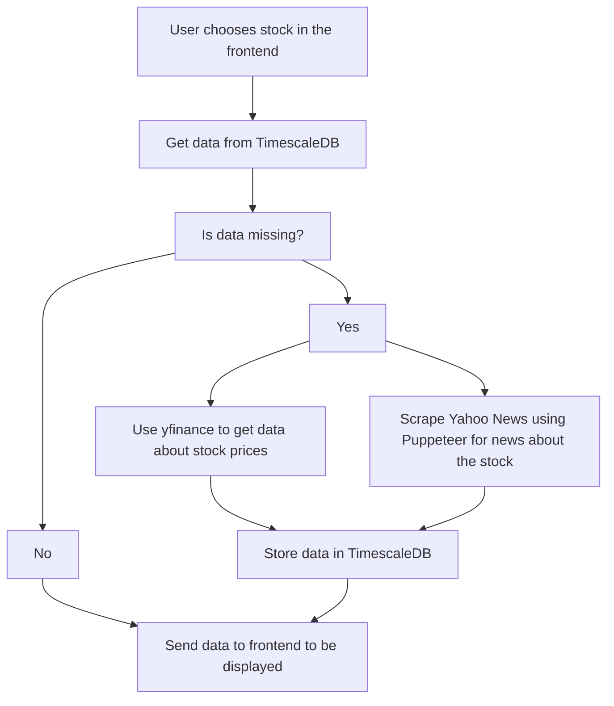

## Project definition
An app or website that shows the timeline of a stock price over long term (5 years+) with major news articles of the stock pinned on the price chart. This way it is easy to see and learn how news affects stock prices past and present. (recommended by marnus.db@gmail.com)
## Project stack
1. **Frontend (UI & Visualization)**
- Next.js 
- React-chartjs-2 for rendering charts
2. **Data fetching**
	- Stock prices
		- Yahoo Finance API (yfinance)
	- News
		- Yahoo News
3. **Database**
	- PostgreSQL + TimescaleDB
4. **Miscellaneous**
	- Luxon for date handling
	- Axios for API calls 
	- Puppeteer for news scraping
## Project flow

## Todo list
### Features
- [X] Add functions to fetch stock data and news articles

### Database
- [] Add functions to cache stock data and news articles in TimescaleDB
- [] Add functions to check cached stock data and news articles before fetching them again

### Frontend
- [] Add communication between the frontend and backend
- [] Add stock graphing capablities
- [] Add styling