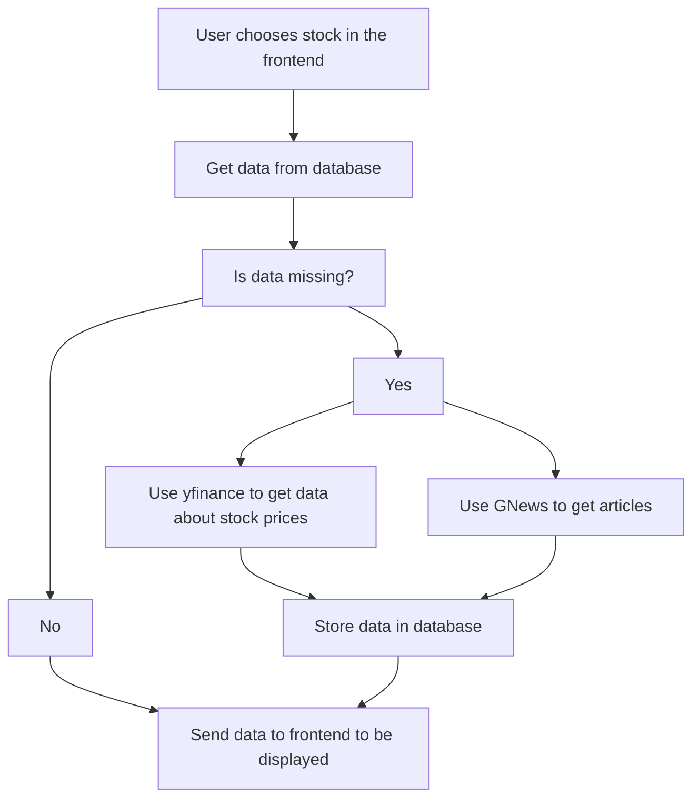

## Project definition
An app or website that shows the timeline of a stock price over long term (5 years+) with major news articles of the stock pinned on the price chart. This way it is easy to see and learn how news affects stock prices past and present.
## Project stack
1. **Frontend (UI & Visualization)**
- Next.js 
- Recharts
2. **Data fetching**
	- Stock prices
		- Yahoo Finance API (yfinance)
	- News
		 - Gnews.io
3. **Database**
	- PostgreSQL + TimescaleDB
4. **Miscellaneous**
	- DateFNS for date handling
	- Axios for API calls
## Project flow

## Todo list
### Features
- [X] Add functions to fetch stock data and news articles
- [X] Add stock graphing capabilities

### Database
- [X] Add functions to cache stock data and news articles in database
- [X] Add functions to check cached stock data and news articles before fetching them again

### Frontend
- [X] Add communication between the frontend and backend
- [ ] Add stock graphing capabilities
- [ ] Add styling
